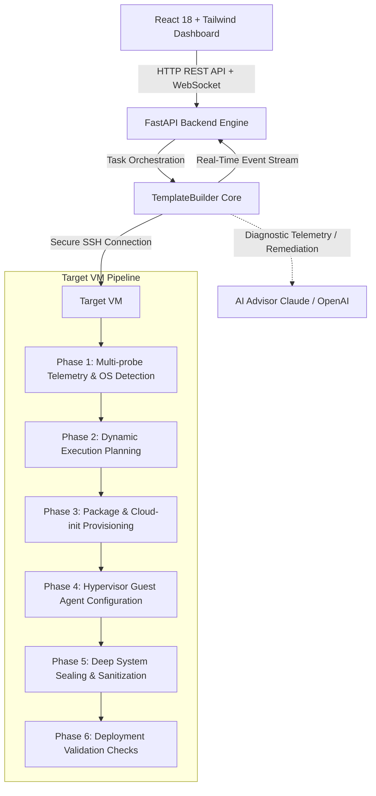

# CloudStack Template Automation Engine

[](https://www.python.org/downloads/)
[](https://fastapi.tiangolo.com)
[](https://react.dev)
[](https://hub.docker.com/repository/docker/dharaneesh5/template/general)
[](https://opensource.org/licenses/MIT)

An intelligent, dynamic, AI-driven automation engine that turns any freshly installed Linux Virtual Machine (on KVM, Xen, VMware, Hyper-V, or Proxmox) into a production-ready, self-configuring **Apache CloudStack Golden Template**.

---

## 🐳 Quick Start — Local WSL / Docker Testing

The pre-built image is published on **[Docker Hub → dharaneesh5/template](https://hub.docker.com/repository/docker/dharaneesh5/template/general)**.

### Pull & Run (no build needed)

```bash
# 1. Copy environment file
cp .env.example .env        # or use the .env already provided

# 2. Pull and start the backend (serves API + Web Dashboard)
docker compose up -d

# 3. Open in browser (from WSL or Windows)
# Web Studio: http://localhost:8000
# API Docs:   http://localhost:8000/docs
```

### Manual pull from Docker Hub
```bash
docker pull dharaneesh5/template:latest
docker run -d \
  --name cloudstack-backend \
  -p 8000:8000 \
  -v $(pwd)/data:/app/data \
  --env-file .env \
  dharaneesh5/template:latest
```

---

## 🏗️ Architecture Overview



---

## 🌟 Key Capabilities

- **Zero Fixed Scripts**: Detects OS distribution, version, package manager (`dnf`, `yum`, `apt-get`, `zypper`), root filesystem (`XFS`, `ext4`, `btrfs`), LVM volume group mappings, and running hypervisor dynamically.
- **CloudStack Cloud-init Provisioning**:
  - `99_cloudstack.cfg`: CloudStack datasource configuration with fallback.
  - `80_user.cfg`: User account password unlock, sudoers permissions, and hostname management.
  - `49_hostkeys.cfg`: Preserves SSH key generation mechanisms on clone creation.
  - `50_growpartition.cfg` & `51_extend_volume.cfg`: Automatic volume and filesystem expansion on first boot.
- **Hypervisor Guest Utilities**: Automatic provisioning of `qemu-guest-agent` (KVM/Proxmox), `xe-guest-utilities` (XenServer/XCP-ng), and `open-vm-tools` (VMware).
- **Deep System Sealing**: Strips machine-id, network persistent udev MAC rules, SSH host keys, temporary files, DHCP leases, and shell history to ensure clean template cloning.
- **Real-Time Telemetry Streaming**: High-performance WebSocket event bus delivers step-by-step progress, terminal logs, and validation matrices directly to the web dashboard.
- **AI Error Recovery**: Built-in `AIAdvisor` diagnoses failed package steps, apt lock contentions, or repository issues and provides auto-remediation commands.

---

## ⚡ Quick Start (Local Development)

### 1. Backend Setup
```bash
# Create virtual environment
python -m venv venv
# On Linux/macOS:
source venv/bin/activate
# On Windows:
venv\Scripts\activate

# Install dependencies
pip install -r requirements.txt

# Start backend server
python -m uvicorn fastapi_backend:app --reload --host 0.0.0.0 --port 8000
```
*Backend API and Web Dashboard will be live at `http://localhost:8000`.*

### 3. Cleanup & Reset
To stop all containers and remove cached images for a clean retry:
```bash
./cleanup.sh         # Cleans containers and images, keeps database
./cleanup.sh --all   # Cleans containers, images, and purges database
```

---

## 📡 API Reference

| Method | Endpoint | Description |
| :--- | :--- | :--- |
| `GET` | `/api/health` | Service health status |
| `POST` | `/api/template/create` | Start template automation pipeline |
| `GET` | `/api/template/{execution_id}` | Retrieve execution state, logs, and telemetry |
| `GET` | `/api/template` | List execution history |
| `POST` | `/api/template/{execution_id}/cancel` | Cancel an active execution |
| `GET` | `/api/distributions` | List supported distributions & versions |
| `GET` | `/api/hypervisors` | List supported hypervisor platforms |
| `POST` | `/api/ai/diagnose` | Request AI diagnostic advice on step failure |
| `WS` | `/ws/template/{execution_id}` | Live telemetry streaming WebSocket |

---

## 🧪 Testing

Run the automated test suite:
```bash
python -m pytest tests/ -v
```

---

## 🐳 Docker Deployment

```bash
docker-compose up -d --build
```
This deploys:
- `backend`: FastAPI API server on port 8000
- `frontend`: Nginx + React UI on port 3000
- `postgres`: PostgreSQL database for execution log storage

---

## 📄 License
MIT License. Free for commercial and personal use.